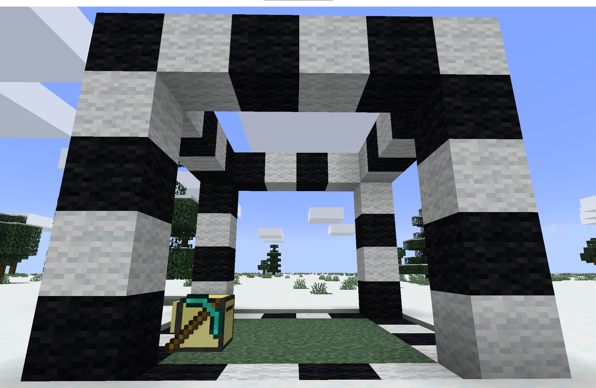

# clearArea-prog

Very simple program to clear of a area of variable size with a mining-turtle

## Setup
You will require a mining turtle with __scm__ installed.

## Usage
_Writing out the programm without the agruments provides the following instructions as well_

<u>run in the Shell:</u>

```lua
clearArea <height> <length> <width>
```

Starts at the bottom right corner of the area (facing the turtle).

### Example
In this example, the turtle would clear the marked 4 x 4 area, starting at the turtles' location.

